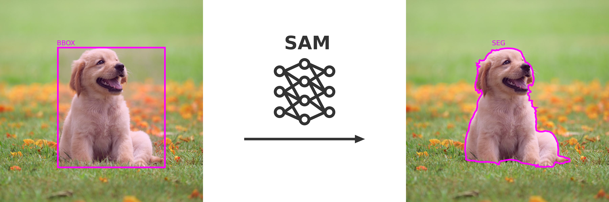

# BBOX to SEG with SAM

This repo uses the Segment Anythin Model ([SAM](https://github.com/facebookresearch/segment-anything))
to automatically convert your bounding box dataset into a segmentation polygon 
dataset. 



This tool will take the `bbox` camp of your COCO label and use that to populate
the `segmentation` camp automatically.

## How to Use

Tested with python 3.10 and higher.

First, clone this repository and install python requirements:
```bash
git clone https://github.com/kikefdezl/bbox-to-seg.git 
pip install -r requirements.txt
```

Then, run:
```bash
python3 main.py COCO_JSON IMAGES OUTPUT
```
where:
- `COCO_JSON`: Path to your COCO JSON file.
- `IMAGES`: Path to the folder with the images.
- `OUTPUT`: Path where you want to save the output to. This can be a folder or
a full path including the filename and `.json` extension.

Example:
```bash
python3 main.py /path/to/my/coco.json /path/to/my/images/ /path/to/my/output.json
```

The program will populate the `segmentation` camp of you annotations in the 
COCO label. This camp will be overwritten if it already exists.
